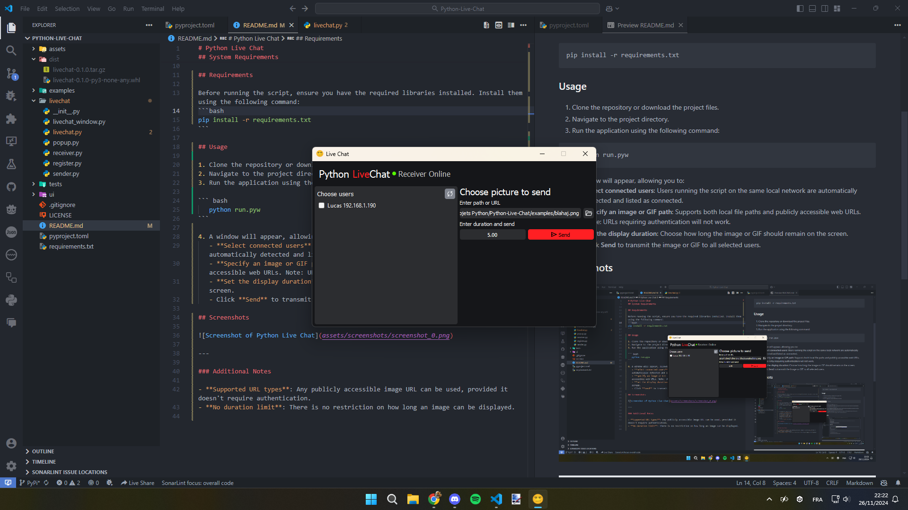

# Python Live Chat  

Python Live Chat is a Python application that allows users to send images and GIFs to selected computers on a local network running the script. The images are displayed in full screen for a specified duration.  

## System Requirements  

- **Windows**: Windows 10, Windows 11 (not tested on earlier versions).  
- **Linux**: Tested on Xubuntu but should work on other distributions.  
- **macOS**: Not tested.  

## Requirements  

Before running the script, ensure you have the required libraries installed. Install them using the following command:  
```bash
pip install -r requirements.txt  
```

## Usage  

1. Clone the repository or download the project files.  
2. Navigate to the project directory.  
3. Run the application using the following command:  

``` bash
   python run.pyw  
```

4. A window will appear, allowing you to:  
   - **Select connected users**: Users running the script on the same local network are automatically detected and listed as connected.  
   - **Specify an image or GIF path**: Supports both local file paths and publicly accessible web URLs. Note: URLs requiring authentication will not work.  
   - **Set the display duration**: Choose how long the image or GIF should remain on the screen.  
   - Click **Send** to transmit the image or GIF to all selected users.  

## Screenshots  

  

---

### Additional Notes  

- **Supported URL types**: Any publicly accessible image URL can be used, provided it doesn't require authentication.  
- **No duration limit**: There is no restriction on how long an image can be displayed.  
